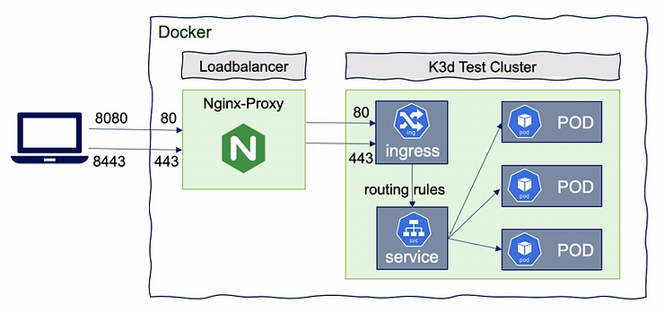
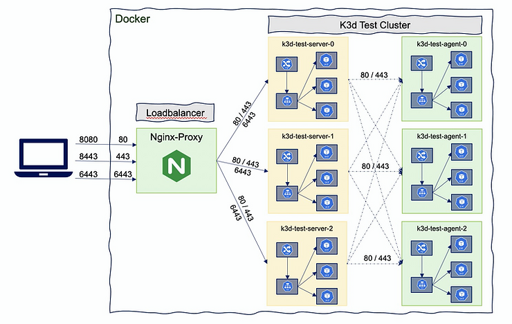
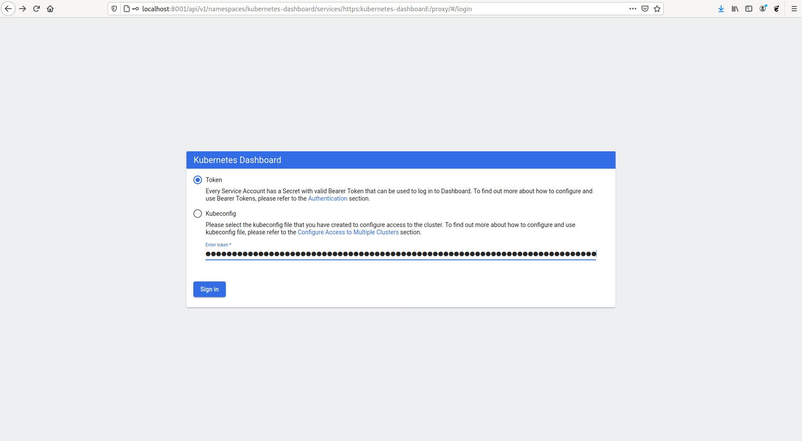
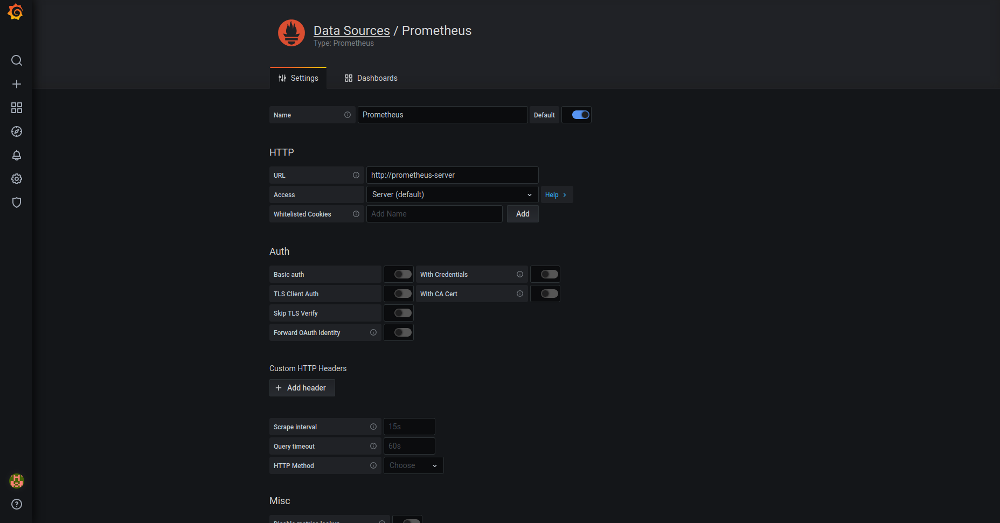

# K3D Persistence Cluster

## TL;DR

```sh
> ./create-cluster.sh
```

This will install all needed software if is not present and follow you in cluster creation.


## Install Software

### Install Docker

```sh
> curl -L -o ./install-docker.sh "https://get.docker.com"
> chmod +x ./install-docker.sh
> ./install-docker.sh
> sudo usermod -aG docker $USER
```

### Install K3D

Firs install k3d on your system with:

```sh
> curl -s https://raw.githubusercontent.com/rancher/k3d/main/install.sh | bash
```

### Install kubectl

Also need install kubernetes client in order to manage cluster

```sh
> curl -LO "https://storage.googleapis.com/kubernetes-release/release/$(curl -s https://storage.googleapis.com/kubernetes-release/release/stable.txt)/bin/linux/amd64/kubectl"
> chmod +x ./kubectl
> sudo mv ./kubectl /usr/local/bin/kubectl
> kubectl version --client
```

## Install Helm

Due we will use helm for some deploymens is recomended you also install helm

```sh
> curl -fsSL -o get_helm.sh https://raw.githubusercontent.com/helm/helm/master/scripts/get-helm-3
> chmod +x ./get_helm.sh
> ./get_helm.sh
```

## Deploy persistence kubernetes cluster

Crete a directory in your host where Kubernetes cluster will be persist data

```sh
> mkdir ./k3dvol
```

### Create Kubernetes Cluster with LoadBalancer

**NOTE**: **`Master`** and **`Workers`** nodes are renamed to **`Server`** and **`Agents`** resp.



Create a Kubernetes Cluster.
For this sample will keep cluster simple but you can set "any number" of agents and workers, the limits is comon sense and your memory.

Note that we are pointing port 443 on host to Cluster Load Balancer's 443 port. If you want use http you can use port 80.  

```sh
> k3d cluster create dev-cluster \
--api-port 6443 \
--port 8443:443@loadbalancer  \
--port 8080:80@loadbalancer \
--volume $(pwd)/k3dvol:/tmp/k3dvol \
--servers 1 --agents 1
```

#### Port Mapping

* `--port 8080:80@loadbalancer` will add a mapping of local host port 8080 to loadbalancer port 80, which will proxy requests to port 80 on all agent nodes

* `--api-port 6443` : by default, no API-Port is exposed (no host port mapping). It’s used to have k3s‘s API-Server listening on port 6553 with that port mapped to the host system. So that the load balancer will be the access point to the Kubernetes API, so even for multi-server clusters, you only need to expose a single api port. The load balancer will then take care of proxying your requests to the appropriate server node

* `--port "32000-32767:32000-32767@loadbalancer"`
You may as well expose a NodePort range (if you want to avoid the Ingress Controller).
**Warning**: Map a wide range of ports can take a certain amount of time, and your computer can freeze for some time in this process.

### Manage Clusters

Once cluster is created we can `start`, `stop` or even `delete` them

```sh
> k3d cluster start <cluster-name>
> k3d cluster stop <cluster-name>
> k3d cluster delete <cluster-name>`
```


### Mange cluser nodes



#### List cluster nodes

```sh
> k3d node ls
NAME                       ROLE           CLUSTER       STATUS
k3d-k3d-cluster-agent-0    agent          k3d-cluster   running
k3d-k3d-cluster-agent-1    agent          k3d-cluster   running
k3d-k3d-cluster-server-0   server         k3d-cluster   running
k3d-k3d-cluster-serverlb   loadbalancer   k3d-cluster   running
```

#### Add/Delete new nodes to cluster

Create new nodes (and add them to existing clusters)

```sh
> k3d node create <nodename> --cluster <cluster-name> --role <agent/server>
```

To delete nodes just use:

```sh
> k3d node delete <nodename>
```

Example
```sh
> k3d node ls
NAME                       ROLE           CLUSTER       STATUS
k3d-k3d-cluster-agent-0    agent          k3d-cluster   running
k3d-k3d-cluster-agent-1    agent          k3d-cluster   running
k3d-k3d-cluster-server-0   server         k3d-cluster   running
k3d-k3d-cluster-serverlb   loadbalancer   k3d-cluster   running

> k3d node create my-new-agent-node --cluster k3d-cluster --role agent
INFO[0000] Starting Node 'k3d-my-new-agent-node-0'

> k3d node ls
NAME                       ROLE           CLUSTER       STATUS
k3d-k3d-cluster-agent-0    agent          k3d-cluster   running
k3d-k3d-cluster-agent-1    agent          k3d-cluster   running
k3d-k3d-cluster-server-0   server         k3d-cluster   running
k3d-k3d-cluster-serverlb   loadbalancer   k3d-cluster   running
k3d-my-new-agent-node-0    agent          k3d-cluster   running

> k3d node delete  k3d-my-new-agent-node-0
INFO[0000] Deleted k3d-my-new-agent-node-0   

> k3d node ls
NAME                       ROLE           CLUSTER       STATUS
k3d-k3d-cluster-agent-0    agent          k3d-cluster   running
k3d-k3d-cluster-agent-1    agent          k3d-cluster   running
k3d-k3d-cluster-server-0   server         k3d-cluster   running
k3d-k3d-cluster-serverlb   loadbalancer   k3d-cluster   running

```


#### Start/Stop nodes

Also can just stop or start nodes previously created with


```sh
> k3d node start <nodename>
> k3d node stop <nodename>
```

k3d create/start/stop/delete node mynode

### Manage your registry

Create or delete a local kubernetes internal registry

```sh
> k3d registry create REGISTRY_NAME 
> k3d registry delete REGISTRY_NAME
```


### Replace Ingress Controler

K3D uses Traefik 1.x versios as Ingress controler, due Traefik 2.x is enough mature and provide more functionalities we need do some extra work to use Traefik.

First we create a new file `helm-ingress-traefik.yaml` 

```yaml
# see https://rancher.com/docs/k3s/latest/en/helm/
# see https://github.com/traefik/traefik-helm-chart
apiVersion: helm.cattle.io/v1
kind: HelmChart
metadata:
  name: ingress-controller-traefik
  namespace: kube-system
spec:
  repo: https://helm.traefik.io/traefik
  chart: traefik
  version: 9.8.0
  targetNamespace: kube-system
```


Now we can create a new cluster telling to k3d not deploy traefik with 
`--k3s-server-arg '--no-deploy=traefik'` and use previous helm chart defined to deploy new Traefik Ingress Controler
`--volume "$(pwd)/helm-ingress-traefik.yaml:/var/lib/rancher/k3s/server/manifests/helm-ingress-traefik.yaml"`


```sh
> k3d cluster create traefik --k3s-server-arg '--no-deploy=traefik' --volume "$(pwd)/helm-ingress-traefik.yaml:/var/lib/rancher/k3s/server/manifests/helm-ingress-traefik.yaml"

```

## Deploy  on Kubernetes

### Configure KUBECONFIG

By default k3d add cluster to `~/.kube/config` file. 

We can choose default cluster with 

```sh
> kubectl config use-context k3d-<cluster-name>
```

or setting KUBECONFIG enviroment 

```sh
> export KUBECONFIG=$(k3d kubeconfig write <cluster-name>)
```

#### Manage Kubeconfig
K3D provide some commands to manage kubeconfig

get kubeconfig from cluster dev

```sh
> k3d kubeconfig get <cluster-name>
```

create a kubeconfile file in $HOME/.k3d/kubeconfig-dev.yaml 
```sh
> kubeconfig write <cluster-name>
```
get kubeconfig from cluster(s) and  merge it/them into a file in $HOME/.k3d or another file

```sh
> k3d kubeconfig merge ...
```

### Deploy Kubernetes Dashboard

Deploy kuebernetes dashboard with

```sh
> kubectl config use-context k3d-<cluster-name>
> kubectl apply -f https://raw.githubusercontent.com/kubernetes/dashboard/v2.0.0/aio/deploy/recommended.yaml
```

Now we need create a dashboard acount and bind this acount to `cluster-admin-role`

```sh
> kubectl create serviceaccount dashboard-admin-sa
> kubectl kubectl create clusterrolebinding dashboard-admin-sa --clusterrole=cluster-admin --serviceaccount=default:dashboard-admin-sa
```

after create this user get user token with

```sh
> kubectl describe secret $(kubectl get secrets | grep ashboard-admin-sa | awk '{ print $1 }')
Name:         dashboard-admin-sa-token-bcf79
Namespace:    default
Labels:       <none>
Annotations:  kubernetes.io/service-account.name: dashboard-admin-sa
              kubernetes.io/service-account.uid: 96418a0c-60bd-4eab-aff9-4df4c6c46408

Type:  kubernetes.io/service-account-token

Data
====
ca.crt:     570 bytes
namespace:  7 bytes
token:      eyJhbGciOiJSUzI1NiIsImtpZCI6IjNDVFdKdVBZNndaVk5RWkh6dUxCcVRJVGo4RlQwUjFpWHg4emltTXlxRGsifQ.eyJpc3MiOiJrdWJlcm5ldGVzL3NlcnZpY2VhY2NvdW50Iiwia3ViZXJuZXRlcy5pby9zZXJ2aWNlYWNjb3VudC9uYW1lc3BhY2UiOiJkZWZhdWx0Iiwia3ViZXJuZXRlcy5pby9zZXJ2aWNlYWNjb3VudC9zZWNyZXQubmFtZSI6ImRhc2hib2FyZC1hZG1pbi1zYS10b2tlbi1iY2Y3OSIsImt1YmVybmV0ZXMuaW8vc2VydmljZWFjY291bnQvc2VydmljZS1hY2NvdW50Lm5hbWUiOiJkYXNoYm9hcmQtYWRtaW4tc2EiLCJrdWJlcm5ldGVzLmlvL3NlcnZpY2VhY2NvdW50L3NlcnZpY2UtYWNjb3VudC51aWQiOiI5NjQxOGEwYy02MGJkLTRlYWItYWZmOS00ZGY0YzZjNDY0MDgiLCJzdWIiOiJzeXN0ZW06c2VydmljZWFjY291bnQ6ZGVmYXVsdDpkYXNoYm9hcmQtYWRtaW4tc2EifQ.sfnBn4BWTpMK8_jd7EL-G2HvWSE7unW1lqsQ27DMT1D0WpuOQ-o1cEkrEqXFvXIYW8b7ciVcuNHhtQuWswmPbfQ6C8X_d1vbdpXoopVLPvkuHpFTbNMKtagBWJQlY1IepnCP_n4Q6neO82tjJ4uD_zC86RZ9-MebrVYNU5mjGtJ7XygH3c577wqBeIh1YgOvhY_K62QY3FJOHsX1_nTdKF4vphnzQjdIXhkpdCbzYuhvAmg1S7KOS6XFLOH9ytc_elY8k4T7w1UnmxmNPUIQo2fD4hQI-VqT42LruE5CXsrqPxml1aFz-FOID3049m7ZpQez70Ro3n73eHnKSLrDdA
```
Now execute 

```sh
> kubectl proxy
Starting to serve on 127.0.0.1:8001
```
now open URL: 
<http://localhost:8001/api/v1/namespaces/kubernetes-dashboard/services/https:kubernetes-dashboard:/proxy/#/login> 

and use Token to login




### Deploy Prometheus & Grafana

First deploy Prometheus & Grafana and create an ingress entry for Grafana, You can also create another ingress for Prometheus if you need

```sh
> helm repo add prometheus-community https://prometheus-community.github.io/helm-charts
> helm repo add stable https://charts.helm.sh/stable
> helm repo update
> helm install --namespace prometheus --create-namespace prometheus prometheus-community/prometheus
> helm install --namespace prometheus --create-namespace grafana stable/grafana --set sidecar.datasources.enabled=true --set sidecar.dashboards.enabled=true --set sidecar.datasources.label=grafana_datasource --set sidecar.dashboards.label=grafana_dashboard
> cat <<EOF | kubectl create -f -
apiVersion: networking.k8s.io/v1
kind: Ingress
metadata:
  name: nginx
  namespace: prometheus
  annotations:
    ingress.kubernetes.io/ssl-redirect: "false"
spec:
  rules:
    - host: grafana.example.com
      http:
        paths:
          - path: /
            pathType: Prefix
            backend:
              service:
                name: grafana
                port:
                  number: 80
EOF
```


Once all is installed we can retrieve Grafana credentials to login with `admin` user.

```sh
> kubectl get secret --namespace prometheus grafana -o jsonpath="{.data.admin-password}" | base64 --decode ; echo
```

Now we can access Grafana and configure prometheus as  datasource for cluster metrics



### Deploy portainer

```sh
> kubectl apply -f https://raw.githubusercontent.com/portainer/portainer-k8s/master/portainer.yaml
```
Once portainer is deployed you can access thought loadbalancer

```sh
> kubectl -n portainer get svc
NAME        TYPE           CLUSTER-IP      EXTERNAL-IP    PORT(S)                         AGE
portainer   LoadBalancer   10.43.243.166   192.168.96.2   9000:31563/TCP,8000:30316/TCP   9m7s
```

### Deploy simple applications

```sh
> kubectl config use-context k3d-k3d-cluster
> kubectl create deployment nginx --image=nginx
> kubectl create service clusterip nginx --tcp=80:80
> kubectl apply -f  nginx-ingress.yml
```

```yml
# apiVersion: networking.k8s.io/v1beta1 # for k3s < v1.19
apiVersion: networking.k8s.io/v1
kind: Ingress
metadata:
  name: nginx
  annotations:
    ingress.kubernetes.io/ssl-redirect: "false"
spec:
  rules:
  - http:
      paths:
      - path: /
        pathType: Prefix
        backend:
          service:
            name: nginx
            port:
              number: 80
```

Testing deployments:

```sh
> curl localhost:4080
> curl -k https://localhost:4443              
> kubectl get po --all-namespaces -o wide
NAMESPACE     NAME                                      READY   STATUS      RESTARTS   AGE    IP          NODE                       NOMINATED NODE   READINESS GATES
kube-system   metrics-server-86cbb8457f-5bpzr           1/1     Running     0          78m    10.42.0.3   k3d-dev-cluster-server-0   <none>           <none>
kube-system   local-path-provisioner-7c458769fb-hd2cc   1/1     Running     0          78m    10.42.1.3   k3d-dev-cluster-agent-0    <none>           <none>
kube-system   helm-install-traefik-4qh5z                0/1     Completed   0          78m    10.42.0.2   k3d-dev-cluster-server-0   <none>           <none>
kube-system   coredns-854c77959c-jmp94                  1/1     Running     0          78m    10.42.1.2   k3d-dev-cluster-agent-0    <none>           <none>
kube-system   svclb-traefik-6ch8f                       2/2     Running     0          78m    10.42.0.4   k3d-dev-cluster-server-0   <none>           <none>
kube-system   svclb-traefik-9tmk4                       2/2     Running     0          78m    10.42.1.4   k3d-dev-cluster-agent-0    <none>           <none>
kube-system   svclb-traefik-h8vgj                       2/2     Running     0          78m    10.42.2.3   k3d-dev-cluster-agent-1    <none>           <none>
kube-system   traefik-6f9cbd9bd4-6bjp4                  1/1     Running     0          78m    10.42.2.2   k3d-dev-cluster-agent-1    <none>           <none>
default       nginx-6799fc88d8-vcjp5                    1/1     Running     0          29m    10.42.2.4   k3d-dev-cluster-agent-1    <none>           <none>
> kubectl scale deployment nginx --replicas 4
> kubectl get po --all-namespaces -o wide
```

### Deploy Persistence Application  

`persistence-app.yml`

```yml
apiVersion: v1
kind: PersistentVolume
metadata:
  name: task-pv-volume
  labels:
    type: local
spec:
  storageClassName: manual
  capacity:
    storage: 1Gi
  accessModes:
    - ReadWriteOnce
  hostPath:
    path: "/tmp/k3dvol"
---
apiVersion: v1
kind: PersistentVolumeClaim
metadata:
  name: task-pv-claim
spec:
  storageClassName: manual
  accessModes:
    - ReadWriteOnce
  resources:
    requests:
      storage: 1Gi
---
apiVersion: apps/v1
kind: Deployment
metadata:
  name: echo
spec:
  selector:
    matchLabels:
      app: echo
  strategy:
    type: Recreate
  template:
    metadata:
      labels:
        app: echo
    spec:
      volumes:
        - name: task-pv-storage
          persistentVolumeClaim:
            claimName: task-pv-claim
      containers:
      - image: busybox
        name: echo
        volumeMounts:
          - mountPath: "/data"
            name: task-pv-storage
        command: ["ping", "127.0.0.1"]
```

```sh
> kubectl apply -f persistence-app.yml
> kubectl get pv
NAME             CAPACITY   ACCESS MODES   RECLAIM POLICY   STATUS   CLAIM                   STORAGECLASS   REASON   AGE
task-pv-volume   1Gi        RWO            Retain           Bound    default/task-pv-claim   manual                  2m54s
> kubectl get pvc
NAME             STATUS   VOLUME                                     CAPACITY   ACCESS MODES   STORAGECLASS   AGE
task-pv-claim    Bound    task-pv-volume                             1Gi        RWO            manual         11s
> kubectl get pods
NAME                   READY   STATUS    RESTARTS   AGE
echo-58fd7d9b6-x4rxj   1/1     Running   0          16s
```


References
<https://github.com/rancher/k3d> 
<https://k3s.io/> <https://github.com/k3s-io/k3s> 
<https://en.sokube.ch/post/k3s-k3d-k8s-a-new-perfect-match-for-dev-and-test> 
<https://dev.to/sosan/k3s-y-k3d-buena-combinacion-para-el-desarrollo-en-local-y-tests-locales-a48> 
https://sysdig.com/blog/kubernetes-monitoring-prometheus-operator-part3/
<https://sysdig.com/blog/kubernetes-monitoring-prometheus/> 
<https://sysdig.com/blog/kubernetes-monitoring-with-prometheus-alertmanager-grafana-pushgateway-part-2/>
<https://sysdig.com/blog/kubernetes-monitoring-prometheus-operator-part3/>